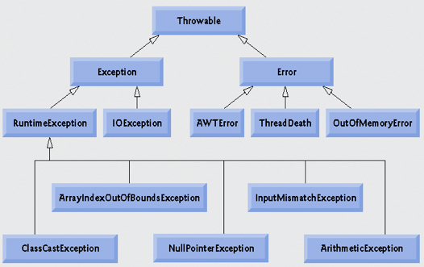
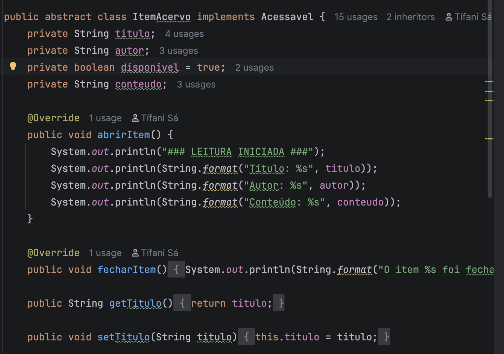

# ESTRUTURA DO CÓDIGO

## 1.1 Situação da Atividade
O projeto desenvolvido refere-se ao Grupo 2: Biblioteca Digital, com os seguintes requisitos:

- **Classe Abstrata:** *ItemAcervo*
  - Atributos: titulo, autor, disponivel
    

- **Subclasses (Herança):**
  - Ebook → atributo específico: tamanhoArquivoMB
  - RevistaDigital → atributo específico: numeroEdicao
        

- **Interface (Contrato):** *Acessavel*
  - Métodos: abrirItem() e fecharItem()
        
  
- **Regras de Negócio:**
  - Um laço de repetição permite buscar um item pelo título
  - Uma estrutura condicional impede a execução do método abrirItem() caso o item não esteja disponível (disponivel = false)


## 1.2 Motivo da Escolha da Estrutura

Para atender aos requisitos da atividade, foi necessária a criação de:


- **Entidades**, representando os itens do acervo
- **Contrato (interface)**, garantindo padronização de comportamento

Além disso, para melhorar a organização e qualidade do projeto, foram adicionadas:


- **Camada de serviços (Service)** → responsável pelas regras de negócio
- **Camada de exceções** → responsável pelo tratamento de erros


Essa separação torna o código mais modular, organizado e de fácil manutenção.

## 1.3 O que é um Contrato (Interface)

Um contrato define um conjunto de regras que uma classe deve seguir.

Ou seja:

- Define **o que deve ser feito**
- Não define **como será feito**


No projeto, o contrato é representado pela interface:

```java
package contratos;

public interface Acessavel {
    void abrirItem();
    void fecharItem();
}
```

Qualquer classe que implemente essa interface é obrigada a implementar esses métodos.


## 1.4 O que é um Serviço (Service)
Um serviço é uma classe responsável por executar ações e regras de negócio, geralmente utilizando outras classes.


No projeto, foram utilizados:

- **AcervoService:**
Responsável pelas operações relacionadas às entidades (itens do acervo)


- **CLIService:**
Responsável pela interação com o usuário
Atua como intermediário entre:
  - o usuário
  - e o serviço do acervo


Essa separação melhora a organização e evita concentração de responsabilidades em uma única classe.


## 1.5 O que é uma Exceção
Uma exceção é um
mecanismo utilizado para tratar erros ou situações inesperadas durante a execução do programa.


Ela funciona como um aviso de erro, interrompendo o fluxo normal da aplicação quando algo incorreto acontece.


### 1.5.1 Hierarquia das Exceções em Java

Todas as exceções derivam da classe principal:



Exemplo de uso utilizados no projeto

#### Try/Catch:

```java
public class ExemploTryCatch {
    public static void main(String[] args) {

        try {
            int resultado = 10 / 0; // erro
            System.out.println(resultado);

        } catch (ArithmeticException e) {
            System.out.println("Erro: divisão por zero");
        }

        System.out.println("Programa continua normalmente");
    }
}
```

#### throw new Exception

```java
throw new Error("Algo deu errado");
```

## O que é uma Entidade
Uma entidade é uma classe que representa um elemento do mundo real dentro do sistema.


Ela possui:

- **Atributos (dados)**
- **Identidade própria** (única no sistema)

No contexto do projeto, as entidades representam os itens do acervo, como:

- Ebook
- RevistaDigital
- ItemAcervo (Classe abstrata)

Essas classes armazenam informações e podem conter comportamentos relacionados ao domínio da aplicação.

### 1.6.1 Diferença entre Classe Abstrata e Classe Normal
#### Classe Normal (Concreta)


Uma classe normal é uma classe que pode ser instanciada diretamente, ou seja, é possível criar objetos a partir dela.

Ela representa uma estrutura completa, já pronta para uso no sistema.

Exemplo:

```java
public class RevistaDigital extends ItemAcervo {
    private String numeroEdicao;
}
```

#### Classe Abstrata
Uma classe abstrata é uma classe que não pode ser instanciada diretamente.

Ela é utilizada como uma base (modelo) para outras classes, definindo atributos e comportamentos que deverão ser herdados.


```java
public abstract class ItemAcervo implements Acessavel {
    private String titulo;
    private String autor;
    private boolean disponivel = true;
    private String conteudo;
}
```

## 2. Explicando as entidades

As entidades do sistema representam os elementos principais da biblioteca digital, ou seja, os itens que podem ser cadastrados e manipulados.


### Classe Abstrata: ItemAcervo

A classe ItemAcervo é uma classe abstrata, responsável por definir a estrutura base de todos os itens do acervo.



Principais características:
- Implementa o contrato Acessavel
- Não pode ser instanciada diretamente
- Serve como base para outras classes

Atributos:

- titulo → nome do item
- autor → autor do conteúdo
- disponivel → indica se pode ser acessado
- conteudo → conteúdo do item

Métodos principais:


**public void abrirItem()**
- Exibe as informações do item
- Simula a leitura do conteúdo

**public void fecharItem()**
- Indica que o item foi fechado


### Classe Ebook
A classe Ebook é uma subclasse de ItemAcervo, representando um tipo específico de item.

```java
public class Ebook extends ItemAcervo
```

**Características:**
- Herda todos os atributos e métodos da classe abstrata
- Possui um atributo próprio:

```java
private String tamanhoArquivoMB;
```

**Construtor:**

```java
public Ebook(String titulo, String autor, String conteudo, String tamanhoArquivoMB)
```

- Utiliza os métodos set da superclasse para definir os atributos
- Inicializa o tamanho do arquivo

### Classe RevistaDigital
A classe RevistaDigital também herda de ItemAcervo.

```java
public class RevistaDigital extends ItemAcervo
```

**Atributo específico:**
```java
private String numeroEdicao;
```

**Função:**
Representa revistas digitais com controle de edição.
